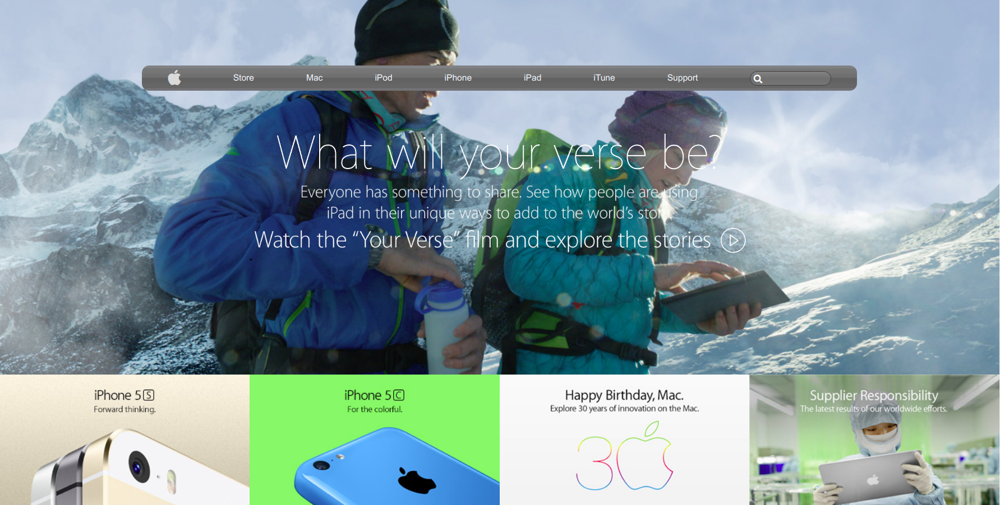

# Old Apple Website Clone 

A project to replicate elements of the old Apple homepage article

## Built With

- HTML5
- CSS3
- Icons from Font Awesome 

## The project has

 - Navigation bar with a color gradient
 - Properly positioned background image
 - Product grid  
 - Footer

## Live Demo

[Live Demo Link](https://ahmetbozaci.github.io/old-apple-website-clone/ )

## Authors

👤 **Ahmet Bozacı**

- Github: [ahmetbozaci ](https://github.com/ahmetbozaci )
- Twitter: [ahmtbozaci](https://twitter.com/ahmtbozaci)
- Linkedin: [ahmetbozaci](https://linkedin.com/in/ahmetbozaci)

👤 **Alaukik**

- Github: [@newhorizon-tech](https://github.com/newhorizon-tech)
- Twitter: [@techintosh3](https://twitter.com/techintosh3)

## 🤝 Contributing

Contributions, issues and feature requests are welcome!

Feel free to check the  [Issues Page](https://github.com/ahmetbozaci/old-apple-website-clone/issues).

## Show your support

Give a ⭐️ if you like this project!
